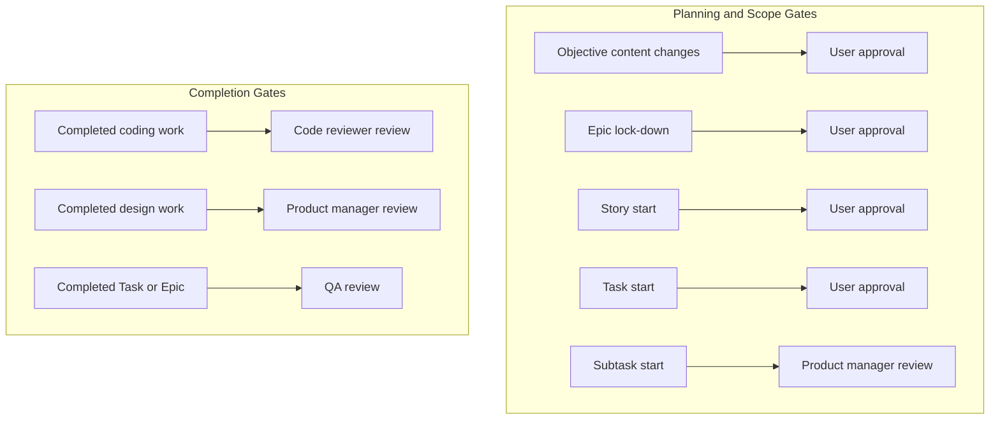

# Approval Matrix

> Note: This approval matrix is currently provisional. Some rules are still under discussion and may be updated as decisions are finalized.  
> Even further, maybe these approvals shouldn't be hardcoded but become a loop setting

1. Objective content changes require user approval after engineering manager discussion.
2. Epic lock-down requires user approval after product manager refinement.
3. Story start requires user approval after product manager refinement.
4. Task start requires user approval after product manager refinement.
5. Subtask start requires product manager review when Subtasks are created.
6. Completed coding work requires code review.
7. Completed design work requires product manager review.
8. Completed Tasks and completed Epics require QA.

## Approval Governance Diagram

