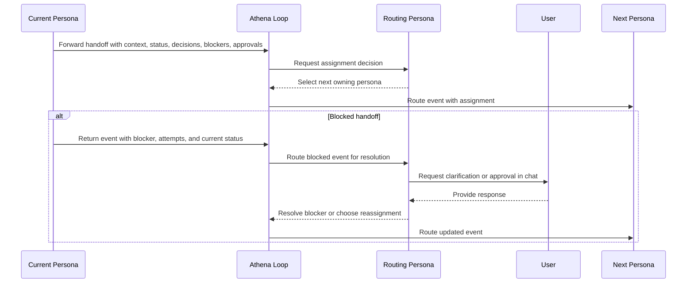

# Handoff Definition

## Forward Handoff

A complete forward handoff (from one persona to another) includes:

1. The work context or event being handed over.
2. Current status.
3. Relevant context and decisions.
4. Dependencies and blockers.
5. Required approvals already obtained.
6. The next expected action.

The active routing persona (`isRouting = true`) determines the next owning persona.

Before finalizing a handoff decision, the active routing persona (`isRouting = true`) may request human interaction through the chat interface when clarification, missing approval, or scope confirmation is required.

## Blocked Handoff (Back to Loop, Then Routing Persona)

If a persona cannot complete an event due to ambiguity, unresolvable dependencies, missing approvals, or other blockers, it hands the event back to the loop with:

1. The event being returned and its current status.
2. The specific blocker or reason it cannot be completed.
3. What was attempted and what failed.
4. Available context and decisions made so far.
5. Athena routes the returned event to the active routing persona (`isRouting = true`), and that routing persona then resolves the blocker or routes to an appropriate persona.
6. During blocker resolution, the active routing persona (`isRouting = true`) may request user input in chat before choosing reassignment or follow-up action.

## Handoff Protocol Diagram

