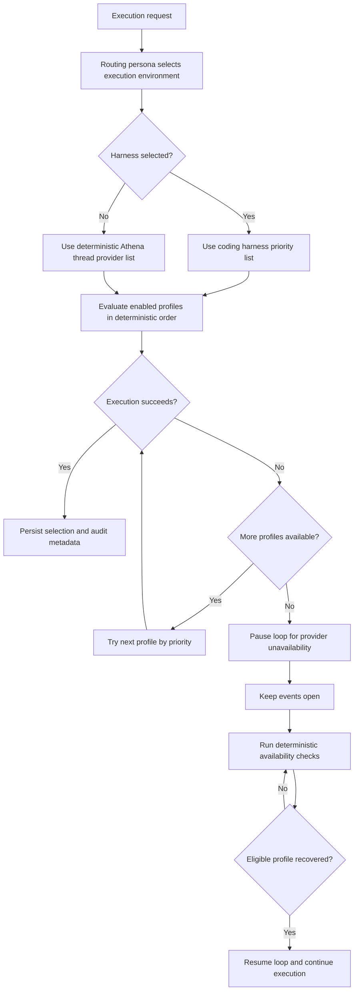

# LLM and Harness Definition

## Purpose

This definition specifies how Athena selects and governs coding harnesses and LLM runtimes per loop.

The goals are:

- deterministic orchestration behavior
- explicit loop-admin control of execution providers
- forward-compatible support for additional harnesses and model providers

## Routing-selected execution environment

Execution environment is selected per event step by the active routing persona (`isRouting = true`) based on event context and the loop persona list provided by Athena.

- Persona definitions are behavior profiles and do not enforce a fixed role dropdown.
- The routing persona can choose a harness-backed execution path or the deterministic Athena thread execution path.
- If an event step is not handled in a harness, it must be handled in the deterministic Athena thread.
- Athena validates the routing decision against loop configuration and deterministic policy before execution.

Athena routing authority remains unchanged. Execution-environment selection does not change ownership, handoff, or approval semantics.

## Definition ownership and visibility

- Harness definitions and provider definitions are independent resources and are not loop-scoped records.
- Definitions are owner-scoped; owners can create, read, update, and delete only their own definitions.
- Secret material is entered directly by the owner and stored using encrypted credential envelopes in PostgreSQL.
- API responses, logs, and audit payloads must never expose plaintext credential material.

## Loop assignment authority and permissions

- Users assign one or more of their harness definitions and provider definitions to loops through many-to-many assignment records.
- Any loop member can assign existing owner-scoped definitions to the loop.
- Only loop administrators can edit assignment ordering, assignment overrides, and runtime tuning fields (priority, timeout, retries, and metrics).
- Order is priority-based (`1..N`) and must be deterministic and unique per loop.

## Coding harness catalog

A **runner** is the execution environment that hosts a harness; a **harness** is the AI coding agent tool that runs within a runner. See [runner-harness.md](./runner-harness.md) for normative definitions and the proprietary vs open runner distinction.

Athena should maintain a registered runner type catalog with per-entry lifecycle state. A harness definition record stores `runnerType` to identify which execution environment it connects to.

MVP catalog policy:

- The loop admin must explicitly configure a harness profile priority list.
- The only runner that is allowed for execution in MVP is GitHub Copilot Cloud (`github-copilot-cloud`).
- If a harness definition targets a different runner type in MVP, Athena must reject activation and return a clear unsupported-in-MVP validation error.

### Runner catalog

| Runner | Type | Identifier | Status |
|---|---|---|---|
| GitHub Copilot Cloud | Proprietary | `github-copilot-cloud` | MVP — only executable runner |
| Juju VM | Open (Athena-owned) | `juju-vm` | Post-MVP (MVP+1) — Athena-owned implementation target |
| Local Ubuntu binary | Open (user-managed) | `local-ubuntu` | Post-MVP — discouraged for production use |

Juju VM is a runner; it hosts harness processes. It is not itself a harness.

### Harness catalog

The harness (agent tool) running within a runner:

| Harness | Compatible runners | Status |
|---|---|---|
| GitHub Copilot | `github-copilot-cloud` (bundled) | MVP |
| OpenCode | `juju-vm`, `local-ubuntu` | Post-MVP candidate |
| Claude Code | `juju-vm`, `local-ubuntu` | Post-MVP candidate |
| Additional open harnesses | `juju-vm`, `local-ubuntu` | Post-MVP — subject to open runner contract |

Additional runners and harnesses may be added to the catalog after capability and security validation.

## Deterministic provider runtime policy (current phase)

- Provider runtime in this phase is OpenRouter-only.
- OpenRouter credentials are entered directly as API keys by the owner and assigned to loops as key pools.
- Provider definitions must not require or store model selection fields.
- Model selection is decided at routing/execution time by the active routing persona and deterministic Athena policy.
- Provider endpoints remain HTTPS-only.
- Multiple OpenRouter keys and multiple Copilot keys can be assigned to a loop.
- Athena definitions remain canonical for behavior and policy regardless of selected provider/key.
- Provider/key choice must not alter deterministic routing, ownership rules, or approval authority.

## Loop key-selection algorithms

Both OpenRouter and Copilot key pools must support:

1. Round Robin
2. Highest Credit Percentage Available
3. Highest Absolute Credit Available
4. Weighted Round Robin by credit
5. Least Recently Used key
6. Priority Failover
7. Health-aware selection with cooldown window

Determinism contract:

- Tie breakers are deterministic: priority, then createdAt, then id.
- Missing metrics or algorithm-specific evaluation failures must use deterministic fallback (priority failover) and preserve audit reason.
- Selection and skip decisions must be auditable per execution attempt.

## Conversation schema validation (Zod)

Athena must auto-validate LLM and harness conversation payloads against Zod schemas before any side-effecting execution step.

- Validation must run before tool invocation, event-status mutation, handoff emission, or persistence of structured conversation outputs.
- Validation schemas are part of deterministic Athena contracts and must be versioned.
- The validation result must be auditable (schema version, pass or fail, failure summary, timestamp).
- Raw provider responses may be retained for diagnostics under governance controls, but only validated payloads can drive orchestration decisions.

When validation fails:

- Athena must treat the response as invalid output, not as a successful execution.
- Athena may retry according to deterministic retry policy.
- If retries are exhausted, Athena must keep the event open and route via existing blocked-handoff protocol in [handoff.definition.md](./handoff.definition.md).

## Deterministic failover model

- For each execution request, Athena first resolves the execution environment from the routing decision (harness-backed path or deterministic Athena thread path).
- Within the selected path, Athena attempts the highest-priority configured provider first.
- If that provider is unavailable, Athena attempts the next configured provider in order until one succeeds or the list is exhausted.
- Failover traversal order must be deterministic and auditable.
- Successful execution through a fallback provider does not change loop ownership or event semantics.

## Provider unavailability handling

- Provider unavailability is an infrastructure availability condition, not an event completion outcome.
- Events must not be auto-completed or auto-blocked solely because configured providers are unavailable.
- If all providers in the relevant priority list are unavailable, Athena pauses loop execution and records the pause reason as provider unavailable.
- While paused for provider unavailability, Athena must keep loop events open and stop dispatching new event execution attempts for that loop.
- Athena must run deterministic availability checks on a configured fixed frequency and resume the loop automatically when an eligible provider becomes available.
- Pause and resume transitions must be auditable with reason, timestamp, and selected provider at resume time.

## Determinism and fallback constraints

- Harness and LLM provider integrations are execution infrastructure and must not redefine Athena policy.
- If a configured provider is unavailable, Athena should fail clearly and preserve auditable failure context.
- Where fallback is configured, fallback activation must be explicit, traceable, and policy-compliant for the loop.

## Cross references

- Tool execution semantics and records: [tool-usage.md](./tool-usage.md)
- Routing and ownership protocol: [interaction.protocol.md](./interaction.protocol.md)
- Loop ownership and membership model: [theloop.md](./theloop.md)

## Provider and Harness Deterministic Failover Diagram

