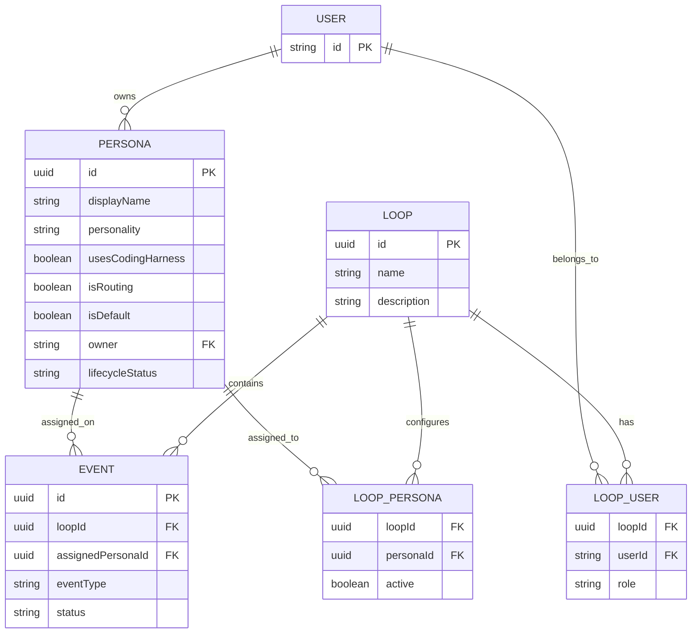

# Persona Definition

## Persona Entity

A Persona is an execution profile used by Athena routing. Personas are defined independently of loops and assigned to loops via the `loopPersona` junction table.

- Personas are persisted in the database independently of any specific loop.
- Persona records provide the behavior and personality context Athena passes during routing and execution.
- Persona membership and definitions are resolved from loop data at runtime.
- Persona definitions describe behavior and execution preferences; they do not enforce a fixed role dropdown.

## Persona Ownership

Each persona has an `owner` field that records the user who created it.

- The `owner` field references the `user` table (`user.id`, the user's email address).
- Default personas have `owner = NULL` (they are system-created, not user-owned).
- Only the owner of a persona may edit it directly.
- Users who are not the owner of a persona may use the **Clone & Edit** action to create a new persona pre-filled with the original's data, owned by themselves.

## Default Personas

Athena maintains a default persona catalog.

- Default personas are seeded at migration time from the reference persona files in [../personas](../personas).
- Default personas are assigned to every new loop at loop creation time.
- Default personas cannot be deleted.

## Loop Persona Management

Users can manage personas in a loop with the following constraints:

1. Users can create personas (the creating user becomes the owner).
2. Users can edit personas they own.
3. Users who do not own a persona can clone it (creating a new persona owned by them).
4. Users can remove personas from a loop (does not delete the persona unless it is non-default with no remaining loop assignments).
5. Default personas cannot be deleted.
6. Each loop must always have exactly one active routing persona.
7. Event execution environment (harness-backed path or deterministic Athena thread path) is selected per event by routing decision as defined in [llm-harness.md](./llm-harness.md).

## Deterministic Routing Inputs

Athena deterministically provides the routing persona with:

- the full persona list for the active loop
- each persona's current personality/definition context

These deterministic inputs are used by the routing persona to select the next assigned persona for each routing decision.

## Persona, Loop, and Event Data Model Diagram

