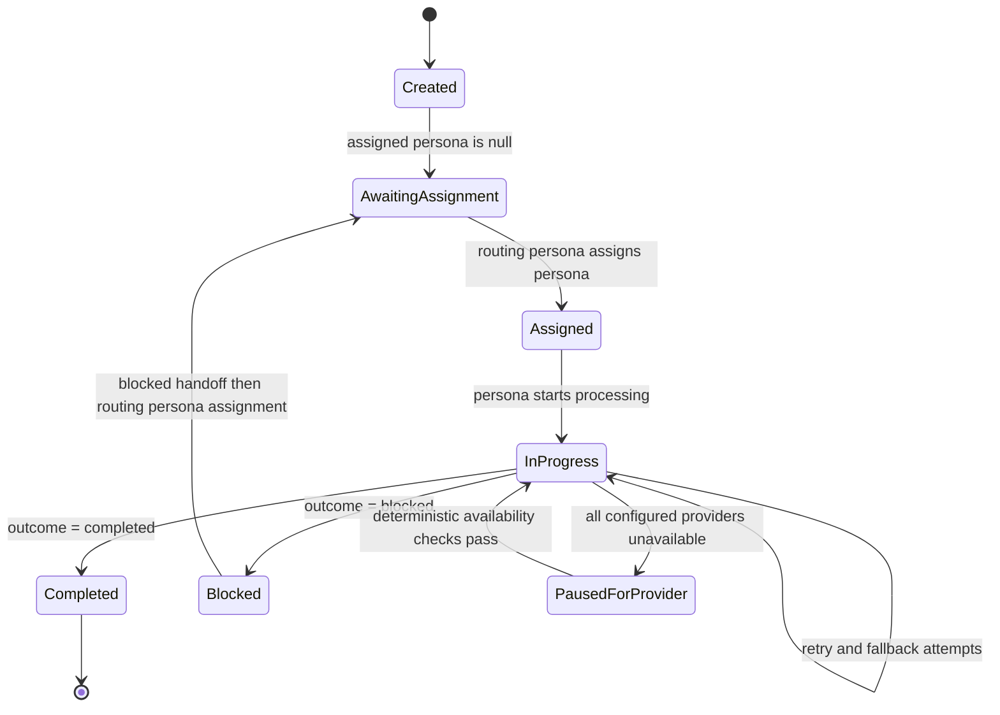

# Task Definition

## Task Entity

A Task is the first-class unit of work within Athena orchestration. Tasks provide context to assigned personas (typically LLM agents) to perform work.

- Tasks are emitted into an existing loop.
- Each task belongs to exactly one loop.
- Tasks capture ownership, status, and execution context.
- Tasks can be edited after creation to update context, status, blockers, or approvals.
- Tasks do not have steps; if additional work is needed, new tasks are created.
- Tasks can refer to each other to represent dependencies or sequencing relationships.
- In the chat UI, each user message and each engineering manager response is backed by a task. Internal tasks spawned by the engineering manager to consult other personas are not surfaced in the chat UI.

## Required Task Information

Each task must include:

- context information (goals, constraints, and scope for the work to be performed)
- assigned persona (set only when the active routing persona with `isRouting = true` pushes an assigned task to the loop)
- task type
- current status
- relevant blockers and approvals

In horizontally scaled execution, task lifecycle operations must be deterministic and concurrency-safe:

- Task status mutation must use atomic write semantics with concurrency protection.
- Duplicate execution attempts for the same task must be safely ignored or collapsed through idempotency controls.
- Observed final task outcome must not depend on which Athena instance processed the winning execution attempt.

## Task Outcomes

When a persona finishes processing a task, the task reaches one of two outcomes:

- `completed`: The persona has finished the work and no further action is needed for that task.
- `blocked`: The persona encountered a blocker and the task is handed back to the loop, then routed by Athena to the active routing persona (`isRouting = true`) for resolution.

Task outcomes do not create new tasks. A completed or blocked task ends the persona's responsibility for that task but does not close the loop. Loops do not have outcomes; tasks do.

Provider or harness unavailability is not a task outcome by itself. Athena must not auto-complete or auto-block tasks solely due to provider outage.

## Possible Task Sources (MVP)

1. [User request](./user-request.md)
2. Agent task
3. [Webhook task](./webhook-task.md)
4. [Tool execution task](./tool-usage.md)
5. Scheduler task
6. System task
7. Manual override task

### Tool execution task source

When tool usage is represented as a task source, the source payload must identify the originating task and include a tool execution record as defined in [tool-usage.md](./tool-usage.md).

- Tool execution tasks are evidence-bearing context updates.
- Tool execution tasks do not transfer ownership on their own.
- If tool execution creates ambiguity or blockers, Athena routes through the active routing persona (`isRouting = true`) according to [theloop.md](./theloop.md).

## Task Lifecycle Diagram

