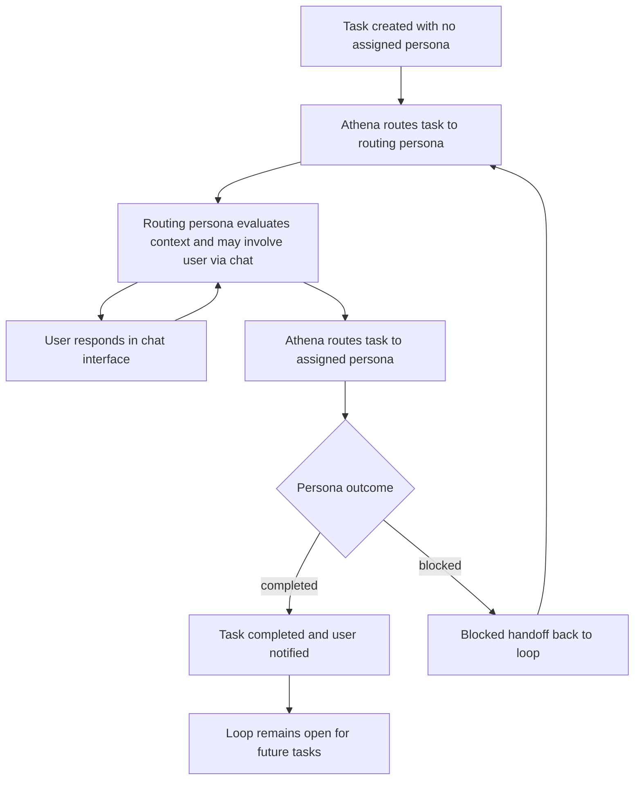

# The Loop

Athena is the deterministic orchestration system. The loop describes the deterministic processes Athena executes as it routes tasks through personas and manages their outcomes.

Athena routes each task to the loop's active routing persona (`isRouting = true`), and that routing persona decides the next assigned persona for execution.

Only the active routing persona (`isRouting = true`) can push a task to the loop with an assigned persona.

For each routing decision, Athena deterministically feeds the active routing persona (`isRouting = true`) with the loop's persisted persona roster and the corresponding persona definition context defined in [persona.md](./persona.md).

The active routing persona (`isRouting = true`) can involve the user in the loop through the chat interface before finalizing assignment when clarification, approval, or scope confirmation is needed.

1. When a task is created with no assigned persona, Athena asks the active routing persona (`isRouting = true`) for an assignment.

   The routing persona may ask follow-up questions through the chat interface and incorporate the user's response before selecting the next assigned persona.

   Personas:
   - Routing persona (`isRouting = true`)

   Files:
   - [responsibility.rules.md](./responsibility.rules.md)
   - [interaction.protocol.md](./interaction.protocol.md)
   - [handoff.definition.md](./handoff.definition.md)
   - [approval.matrix.md](./approval.matrix.md)

2. Athena routes the task with its context to the assigned persona. The persona processes the task, and either a new task is emitted for another persona, or the task is marked as completed and the user is notified.

   Personas:
   - Assigned persona

   Files:
   - [responsibility.rules.md](./responsibility.rules.md)
   - [interaction.protocol.md](./interaction.protocol.md)
   - [handoff.definition.md](./handoff.definition.md)

3. Task entity requirements are defined in [task.md](./task.md).

4. If a persona cannot complete a task due to ambiguity, dependency, missing approval, or other blockers, it performs a blocked handoff back to the loop. Athena then routes the returned task to the active routing persona (`isRouting = true`). See the blocked handoff protocol in [handoff.definition.md](./handoff.definition.md).

   Personas:
   - Assigned persona
   - Routing persona (`isRouting = true`)

   Files:
   - [handoff.definition.md](./handoff.definition.md)

5. When a task is marked as completed, it means the assigned persona has finished processing the task and no more work is required from that persona for that task.

   Personas:
   - Assigned persona

   Files:
   - [responsibility.rules.md](./responsibility.rules.md)
   - [handoff.definition.md](./handoff.definition.md)

6. A completion or blocked task concludes only the current step. The loop itself remains available for future tasks and follow-up work.

   Personas:
   - Routing persona (`isRouting = true`)

   Files:
   - [interaction.protocol.md](./interaction.protocol.md)
   - [handoff.definition.md](./handoff.definition.md)

## Loops

A loop and user relationship is many-to-many. A user can belong to multiple loops, and a loop can include multiple users. Each loop groups the tasks that belong to an ongoing work context.

Every loop must include exactly one engineering manager persona. This engineering manager persona is the required active routing persona (`isRouting = true`) and fallback owner for blocked tasks and unresolved ownership decisions. Users can edit the engineering manager persona, but they cannot create or delete it.

- A loop has a human-readable name and an optional description to identify the work context.
- Loop-user membership is represented through the `loopUser` junction relation.
- The user who creates a loop becomes an admin member of that loop.
- Loop admins configure the loop's coding harness priority list and OpenAI API-compatible LLM provider priority list as defined in [llm-harness.md](./llm-harness.md).
- If all configured providers for required execution are unavailable, Athena pauses loop execution and resumes automatically after deterministic availability checks detect provider recovery.
- Provider-unavailability pauses do not close loop tasks; tasks remain open until normal execution can resume.
- Listing loops for a user returns the loops they belong to.
- Loops are long-lived. They stay available after tasks are completed or blocked.

## Task Reference

Task entity semantics, required fields, outcomes, and sources are defined in [task.md](./task.md).

## Loop Orchestration Diagram

