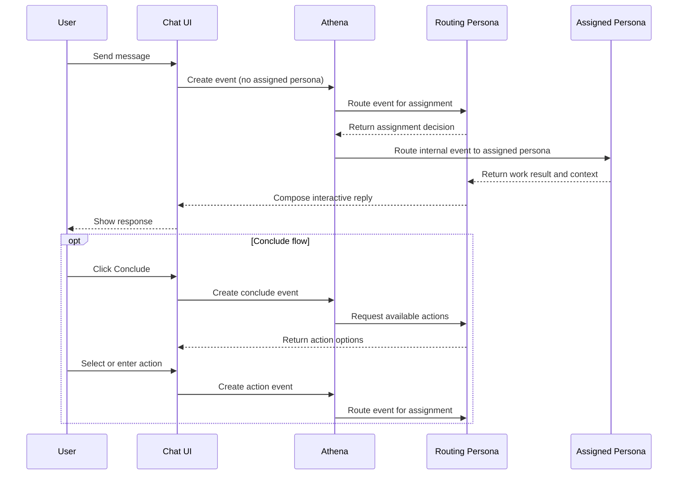

# User Request

## Definition

A user request is a message or instruction submitted by a user that triggers a new event in a loop.

## Characteristics

- A user request is always associated with an existing loop.
- When a user submits a request, Athena creates an event in the loop with no assigned persona.
- Athena then routes the event to the active routing persona for assignment, following the standard loop flow in [theloop.md](./theloop.md).

## Content

A user request should include enough context for the active routing persona to assign the event and select the appropriate execution persona. Recommended content:

- A clear description of the desired outcome or task.
- Any constraints, deadlines, or scope boundaries.
- References to related events if applicable.

## Chat UI

User requests are submitted through a chat interface. The chat interface is the primary surface for user-to-loop interaction.

### Interaction model

- The user sends messages in a chat window associated with a loop.
- Each message from the user creates a new event in the loop.
- The active routing persona responds to each event interactively, and its replies appear as chat messages in the UI.
- If the active routing persona needs input or output from another persona, it spawns a new event internally. The result is fed back to the active routing persona, which then continues the chat reply. Internal spawned events are not shown as separate chat entries.
- The chat interface presents the interaction as a continuous conversation, abstracting the underlying event model from the user.

### UI actions

#### Conclude

The chat UI provides a **Conclude** button. Clicking Conclude does not immediately close the chat. Instead:

1. Clicking Conclude triggers a new event in the loop.
2. Athena routes this event to the active routing persona.
3. The active routing persona responds with a list of available actions for the current chat context (for example: Implement, Take action, Create a plan).
4. Athena presents these options to the user in the UI as a selectable list. The UI also provides a free-text input field for the user to enter a custom action.
5. When the user selects or enters an action, a new event is triggered in the loop with that action as context. The standard routing flow applies: Athena routes the event to the active routing persona for assignment.

#### Back to chat

After clicking Conclude, the user can return to the active chat at any time using a **Back to chat** button. This restores the chat to its previous state without triggering any new events. Any pending conclude action is discarded.

## Chat Interaction Model Diagram

