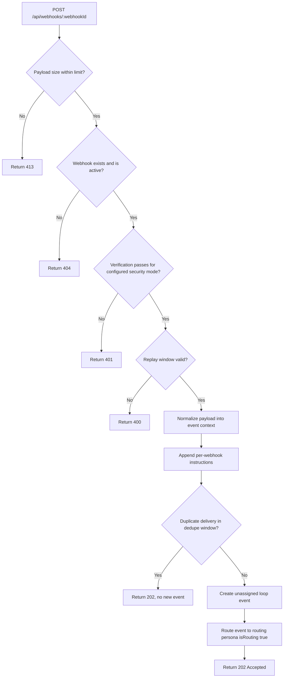

# Webhook Event

## Definition

A webhook event is an event triggered by an inbound webhook payload from an external system configured for a loop. Webhook ingestion is optional and must be configured per loop.

Implementation details for this source are defined in [implementation-plans/index.md](../implementation-plans/index.md).

## Characteristics

- Webhook ingestion must be explicitly configured for the loop. It is not active by default.
- Each webhook configuration has a unique endpoint URL.
- When a webhook payload is received, Athena creates an event in the loop with the payload as context and no assigned persona.
- Athena then routes the event to the active routing persona for assignment, following the standard loop flow in [theloop.md](./theloop.md).

## Supported Sources

Any system capable of sending an HTTP webhook can be a source. Common examples:

- Jira (issue created, status changed, comment added)
- GitHub (pull request opened, review requested, check completed)
- Other third-party tools configured by the user

## Content

The webhook payload is normalized into event context by Athena before being passed to the active routing persona. The context includes:

- The originating system and event type.
- The payload body, normalized to the event context format defined in [event.md](./event.md).
- Any loop-specific mapping rules configured by the user.
- Per-webhook instructions configured on the webhook record and appended to the active routing persona context.

## Webhook Ingestion Pipeline Diagram

