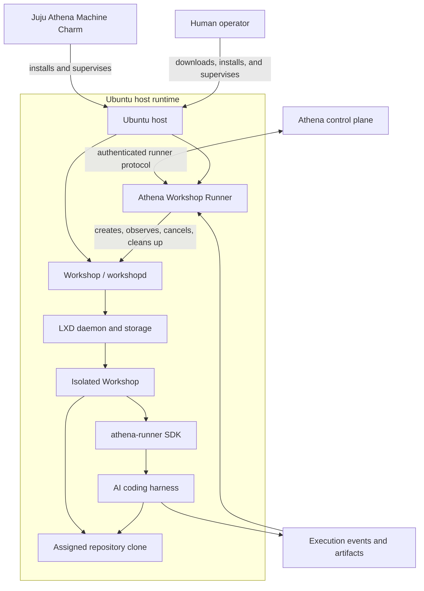

# Athena Workshop Runner

## Architecture

## Purpose

This definition specifies the Athena-owned open runner contract for executing a
harness in an Ubuntu Workshop environment. The environment can run on the
Juju VM provisioned by the [Juju Athena Machine Charm](./juju-athena-machine-charm.md) or
on any supported Ubuntu machine with Workshop installed.

Workshop supplies the isolated workspace, network access, and lifecycle
management; it does not interpret tasks or act as a harness.

The Ubuntu host installation is responsible for installing and supervising the
Athena Workshop Runner. The Workshop definition and `athena-runner` SDK provide
the in-Workshop harness environment. The Athena Workshop Runner remains
responsible for the privileged Workshop lifecycle and the authenticated bridge
to Athena.

## Installation paths

The same Athena Workshop Runner can be installed and supervised through either
of these paths:

1. **Juju Athena Machine Charm** — provisions an Ubuntu host and manages the
   runner installation, configuration, upgrades, and service lifecycle.
2. **Human operator** — downloads and installs the runner directly on any
   supported Ubuntu host and supervises it using the documented service and
   Workshop administration commands.

These are deployment mechanisms, not separate runner types. Both produce the
same `athena-workshop` runner and the same Athena execution contract.

## Scope and boundaries

The Workshop runner owns:

1. Workshop and workspace lifecycle.
2. Harness process startup, supervision, and termination.
3. Assigned repository cloning and task workspace isolation.
4. Communication with Athena over an authenticated channel.
5. Resource, capability, and execution status reporting.

The Workshop runner does not own:

1. Persona routing or model/provider selection.
2. Task interpretation, planning, or agentic decisions.
3. Loop membership or runner assignment policy.
4. Long-term task state outside execution records owned by Athena.

Athena remains the source of truth for task state, approvals, assignments,
timeouts, and final execution outcome.

## Athena Workshop Runner catalog

| Runner | Identifier | Ownership | Status |
|---|---|---|---|
| Athena Workshop Runner | `athena-workshop` | Any supported Ubuntu machine with Workshop | Validated deployment path; adapter pending |

The `athena-workshop` runner is the only open runner catalog entry. Ubuntu
Workshop creates isolated LXD system containers for harness executions.
The `athena-runner` SDK packages the harness-facing tools, actions, and
reporting hooks inside each Workshop; it does not replace the Athena Workshop
Runner on the Ubuntu host.

## Juju VM Charm deployment

The [Juju Athena Machine Charm](./juju-athena-machine-charm.md) is a releasable host
deployment for the `athena-workshop` runner. It is intentionally not a runner
catalog entry: the same runner can be installed on any supported Ubuntu host.

The Workshop SDK is published as `athena-runner` and is installed inside each
Workshop. The charm installs the host prerequisites and runner agent; it does
not change the runner contract.

### Validated prerequisites

1. Ubuntu machine, optionally provisioned and supervised by Juju.
2. LXD 6.8 or newer with a usable storage pool and Workshop network.
3. Ubuntu base-image access through the environment’s egress path.
4. Proxy configuration available to both LXD and the privileged `workshopd`
   service when direct outbound HTTPS is unavailable.
5. The Athena Workshop Runner can access Workshop through its local control interface
   without exposing the privileged Workshop or LXD sockets to Athena.

### SDK boundary

The `athena-runner` SDK is an in-Workshop package. It may provide:

1. Harness binaries and their pinned configuration.
2. Reusable Workshop actions for starting and stopping harness work.
3. Repository-clone, task-context, result, and event helpers.
4. A constrained reporting hook through Workshop’s supported interfaces.

It must not:

1. Require direct access to the host’s LXD socket.
2. Receive unrestricted host filesystem mounts.
3. Store Athena credentials in the Workshop definition or repository.
4. Assume Juju is installed on the host.

## Runtime model

Each execution uses a disposable Workshop and a separate clone of its assigned
repository:

1. Athena authenticates and health-checks the runner.
2. The Athena Workshop Runner creates a Workshop and workspace with a unique execution ID.
3. Athena supplies the repository reference, requested revision, harness
   configuration, task context, and bounded execution policy.
4. Workshop installs `athena-runner`, clones the assigned repository at the
   requested revision, and starts the selected harness.
5. The runner streams structured status and output events to Athena.
6. The Athena Workshop Runner asks Workshop to terminate the harness, collects the result, and releases or
   destroys the Workshop according to its retention policy.
7. Athena persists the terminal outcome and resumes the waiting task path.

The runner must make startup, completion, cancellation, and retry operations
idempotent by execution ID. A reconnect must not create a second harness for
an execution that is already active.

## Open runner contract

The Workshop runner agent must provide these operations:

| Operation | Required behavior |
|---|---|
| `health` | Authenticate the caller and report Workshop/LXD readiness, capacity, and contract version. |
| `start` | Start exactly one harness execution for a new execution ID. |
| `status` | Return current state and the last acknowledged event timestamp. |
| `events` | Deliver ordered, resumable execution events. |
| `cancel` | Request graceful termination, then enforce the configured deadline. |
| `artifacts` | Return declared result metadata without exposing secrets. |

The wire protocol may be HTTP, a message transport, or another authenticated
transport. The transport is not part of the semantic contract.

### Execution states

The runner reports the following states in order where applicable:

`accepted` → `preparing` → `running` → `completed`

An execution may instead enter `cancelling`, `cancelled`, `failed`, or
`timed-out`. Terminal states are immutable. Athena must treat a missing or
malformed event as a runner error and retain the last valid state.

### Event requirements

Every event includes:

1. Execution ID.
2. Event timestamp.
3. Current execution state.
4. A bounded event payload.

The runner may emit these event types:

| Event | Purpose | Terminal |
|---|---|---|
| `execution.accepted` | The runner accepted the execution ID and request. | No |
| `execution.preparing` | The Workshop is being created and the repository is being prepared. | No |
| `execution.started` | The Workshop and selected harness are running. | No |
| `execution.progress` | Reports the current bounded execution phase or checkpoint. | No |
| `execution.output` | Delivers bounded, redacted harness output for observability. | No |
| `execution.artifact` | Describes a produced artifact without embedding unrestricted file contents. | No |
| `execution.heartbeat` | Confirms that the runner and harness remain responsive. | No |
| `execution.cancellation-requested` | Confirms that Athena requested execution cancellation. | No |
| `execution.completed` | The harness completed successfully and its result is available. | Yes |
| `execution.failed` | The execution failed and includes a stable safe failure code. | Yes |
| `execution.cancelled` | Cancellation completed and the harness is no longer running. | Yes |
| `execution.timed-out` | The configured execution deadline was exceeded. | Yes |
| `execution.cleanup-completed` | The Workshop and workspace were released successfully. | No |
| `execution.cleanup-failed` | Cleanup failed and requires recovery or operator attention. | No |

Events are resumable from the last acknowledged event timestamp. Logs are
diagnostic output, not the task result, and must be size-bounded and redacted.

## Workspace and repository isolation

1. Each Workshop receives a separate clone of its assigned repository.
2. The clone and workspace are not shared with another active Workshop.
3. Repository access is limited to repositories assigned to the selected
   runner and loop.
4. Credentials are injected only for the duration and scope of the execution;
   they must not be written into logs, artifacts, or persistent workspace data.
5. The runner must define cleanup behavior for success, failure, cancellation,
   and timeout.
6. The runner must report whether the clone and workspace were cleaned
   successfully.

## Capabilities and resource policy

The health response advertises capabilities such as supported harnesses,
operating system, architecture, network mode, and available resources. Athena
must validate requested capabilities before starting an execution.

Each execution receives bounded limits for at least:

1. Wall-clock duration.
2. CPU and memory usage where enforceable.
3. Workspace storage.
4. Log and artifact size.
5. Retry count.

The runner may enforce stricter limits, but must not silently relax Athena's
limits.

## Security requirements

The harness is trusted to operate freely inside its assigned Workshop. It may
install tools, create processes, modify files, and use the permissions exposed
by that Workshop without Athena imposing per-command approval or host-level
restrictions. Workshop and LXD provide the security boundary between the
harness and the Ubuntu host.

1. Runner-to-Athena communication must use authenticated, encrypted transport.
2. Runner credentials and harness secrets must be stored as encrypted
   connection material and redacted from responses and logs.
3. Harness processes may run with broad privileges inside the assigned
   Workshop, including installing packages, creating services, and modifying
   the complete repository clone. These privileges must not extend to the
   Ubuntu host, LXD daemon, Workshop daemon, or another Workshop.
4. The Workshop must not expose host filesystem paths, host credentials,
   LXD/Workshop control sockets, or host devices unless an explicit,
   allowlisted capability is part of the execution contract.
5. A runner must reject an execution whose loop, repository, or assignment
   scope cannot be verified.
6. Cancellation and cleanup must remain possible when the harness is
   unresponsive.
7. Network access, CPU, memory, storage, and execution duration remain bounded
   by the Workshop and runner policy even when the harness is otherwise trusted
   inside the Workshop.
8. Artifact publication is allowlisted; arbitrary machine filesystem access is
   never exposed to the harness.

## Failure and recovery

The runner reports a stable failure code and a safe diagnostic message for
preparation, authentication, capacity, harness, timeout, cancellation, and
cleanup failures. Secret material and host-specific sensitive details must not
appear in that message.

Athena may retry only according to the execution policy. A retry creates a new
attempt under the same task execution record and must not overwrite the
previous attempt's outcome. If runner connectivity is lost, Athena polls or
resumes from the last acknowledged event timestamp before deciding that the
execution failed.

## Lifecycle and implementation status

Workshop runners are governed by this contract. The current execution
constraint remains defined in [runner-harness.md](./runner-harness.md): only
`github-copilot-cloud` is executable until the Ubuntu Workshop runner passes
the contract and security gates.

Implementation order:

1. Define and version the Workshop runner protocol and SDK contract.
2. Implement and publish the `athena-runner` SDK.
3. Implement the portable Athena Workshop Runner and Workshop execution adapter.
4. Release the Juju Athena Machine Charm as a managed host deployment.
5. Add harness capability negotiation and execution event resumption.
6. Enable the Workshop runner catalog entry after end-to-end validation.

## Acceptance criteria

1. A Workshop runner can be health-checked, assigned, and selected only when
   its capabilities satisfy the execution request.
2. Every execution has an isolated workspace and an idempotent execution ID.
3. Execution events are ordered, resumable, and persisted with terminal state.
4. Cancellation, timeout, runner loss, and cleanup failure have deterministic
   outcomes.
5. Repository credentials, runner credentials, and harness secrets are never
   exposed in logs, artifacts, or API responses.
6. The Juju VM Charm deployment and portable Ubuntu Workshop implementation
   conform to this semantic contract.

## Related specifications

- [runner-harness.md](./runner-harness.md)
- [llm-harness.md](./llm-harness.md)
- [runner-connection.plan.md](../implementation-plans/runner-connection.plan.md)
- [theloop.md](./theloop.md)
- [nfr.md](./nfr.md)

External implementation references:

- [Ubuntu Workshop](https://ubuntu.com/workshop)
- [Workshop architecture](https://ubuntu.com/workshop/docs/explanation/architecture/components/)
- [LXD proxy configuration](https://documentation.ubuntu.com/lxd/latest/server/)
