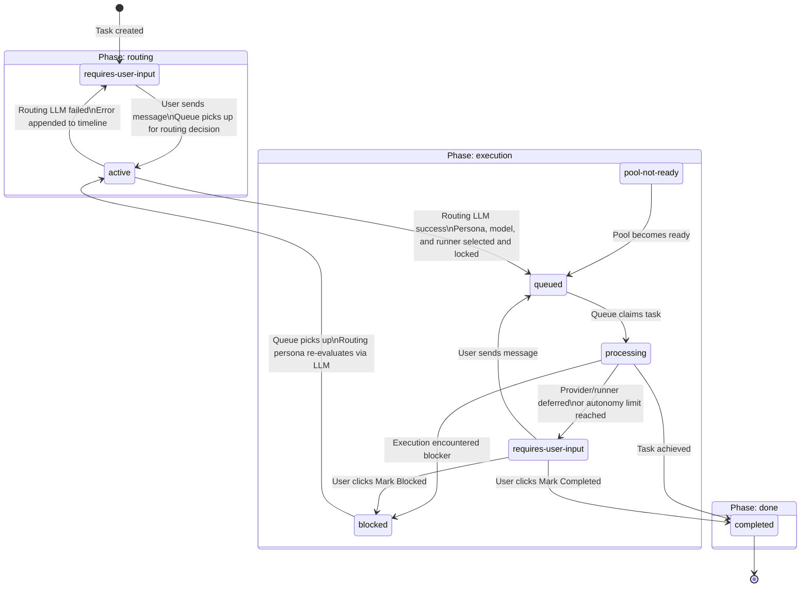

# Athena task lifecycle

This document defines the authoritative task phase and status model for Athena.

## Phases and statuses

Phases and statuses are separate orthogonal fields on every task.

**Phase** expresses the coarse purpose of the task at this point in its lifetime.
**Status** expresses the fine-grained operational state within that phase.

### Phases

| Phase | Purpose |
|---|---|
| `routing` | Determine which persona, model, and execution target type should handle this task from the recorded conversation context. |
| `execution` | Execute the task using the selected persona, model, and runner. |
| `done` | Terminal phase for tasks that have reached completion. |

### Statuses per phase

| Phase | Status | Meaning |
|---|---|---|
| `routing` | `requires-user-input` | Waiting for the user to chat or provide context. The next routing pass uses the accumulated task conversation history. |
| `routing` | `active` | Queue has claimed the task to run one LLM routing decision over persona, model, and execution target type. |
| `execution` | `queued` | Persona, model, and runner selected; in queue for dispatch. |
| `execution` | `processing` | Currently being processed by queue. |
| `execution` | `requires-user-input` | Execution is paused; waiting for user response or approval. |
| `execution` | `blocked` | Execution encountered a blocker; routing persona must re-evaluate. |
| `execution` | `pool-not-ready` | Loop prerequisites not met; task will be promoted once pool is ready. |
| `done` | `completed` | Task fully completed and terminal. |

---

## Lifecycle diagram

---

## Queue processor claims

The queue processor picks up tasks in the following states:

| Phase | Status | Action |
|---|---|---|
| `routing` | `active` | Run routing LLM decision (persona, model, and runner selection). On success → `execution/queued`. On failure → `routing/requires-user-input`. |
| `execution` | `queued` | Dispatch to selected execution target. |
| `execution` | `blocked` | Routing persona re-evaluates via LLM. On re-route → `execution/queued`. On routing failure → `routing/requires-user-input`. |

---

## Routing phase chat behavior

While a task is in the `routing` phase with status `requires-user-input`:

1. Each user message appended to the task is written as a `chat-session` turn.
2. The task is transitioned to `routing/active` immediately so queue processing can run the routing decision.
3. If routing can proceed, the task transitions to `routing/active` immediately and the queue runs the routing LLM decision.
4. If routing cannot proceed, the task remains in `routing/requires-user-input` and waits for additional user input.
5. The routing LLM call uses the task conversation transcript, falling back to a compact summary plus recent transcript for longer chats.
6. All LLM calls during this phase are recorded as `llm-call` timeline entries for audit.
7. If the chat UI is open, it **automatically updates** to reflect the latest messages as they arrive.

---

## Blocked re-evaluation behavior

When an execution-phase task transitions to `blocked` and is claimed by the queue:

1. The routing persona makes an LLM-driven re-evaluation decision.
2. If the routing persona selects a new persona, model, and runner → task transitions to `execution/queued` with the new selection.
3. If the routing LLM call fails, or the routing persona determines user input is needed → task transitions back to `routing/requires-user-input`.
4. The re-evaluation LLM call is recorded as a `llm-call` timeline entry regardless of outcome.
