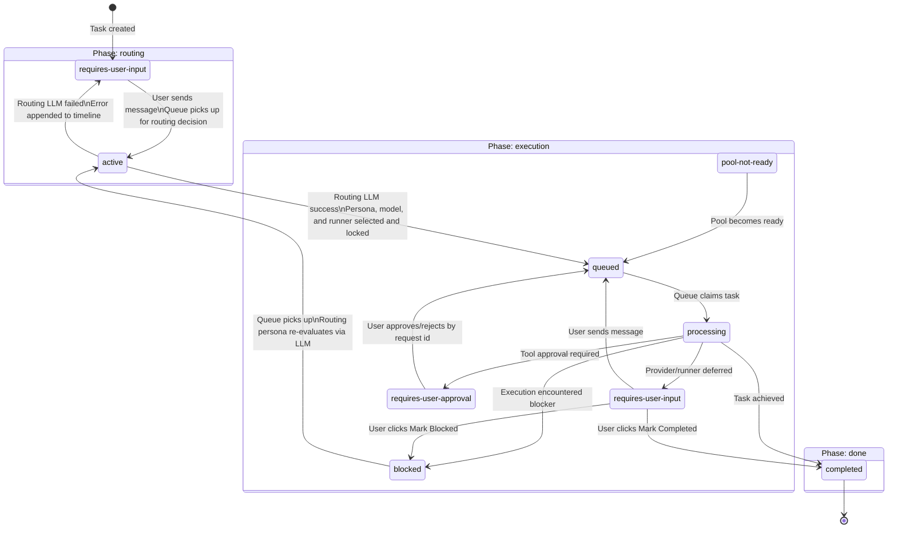
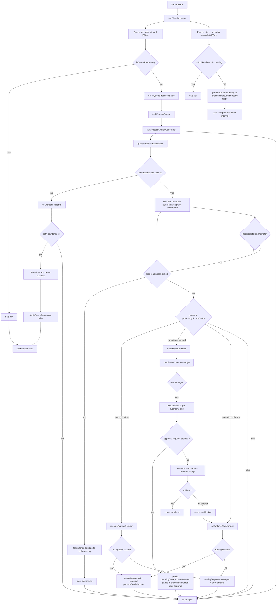

# Athena task lifecycle and processing

This document defines the authoritative task phase and status model for Athena, plus the queue, dispatch, and approval behavior that drives it.

## Scope

- Runtime processor bootstrap: [server.ts](../src/server.ts)
- Processor loop: [task.processor.ts](../src/components/task/task.processor.ts)
- Queue and lifecycle orchestration: [task.controller.ts](../src/components/task/task.controller.ts)
- Queue claiming and persistence: [task.service.ts](../src/components/task/task.service.ts)
- Execution targets: [task.execution.ts](../src/components/task/task.execution.ts)
- Task model, phases, statuses, and approval payloads: [task.schema.ts](../src/components/task/task.schema.ts)

## Phases and statuses

Phases and statuses are separate orthogonal fields on every task.

**Phase** expresses the coarse purpose of the task at this point in its lifetime.
**Status** expresses the fine-grained operational state within that phase.

### Phases

| Phase | Purpose |
|---|---|
| `routing` | Determine which task kind, persona, model, and execution target type should handle this task from the recorded conversation context. |
| `execution` | Execute the task using the selected persona, model, and runner. |
| `done` | Terminal phase for tasks that have reached completion. |

### Statuses per phase

| Phase | Status | Meaning |
|---|---|---|
| `routing` | `requires-user-input` | Waiting for the user to chat or provide context. The next routing pass uses the accumulated task conversation history. |
| `routing` | `active` | Queue has claimed the task to run one LLM routing decision over task kind, persona, model, and execution target type. |
| `execution` | `queued` | Persona, model, and runner selected; in queue for dispatch. |
| `execution` | `processing` | Currently being processed by queue. |
| `execution` | `requires-user-input` | Execution is paused; waiting for user response. |
| `execution` | `requires-user-approval` | Execution is paused; waiting for explicit user approval/rejection of a pending tool approval request. |
| `execution` | `blocked` | Execution encountered a blocker; routing persona must re-evaluate. |
| `execution` | `pool-not-ready` | Loop prerequisites not met; task will be promoted once pool is ready. |
| `done` | `completed` | Task fully completed and terminal. |

## Processing model

### Lifecycle diagram

### Queue processor claims

The queue processor picks up tasks in the following states:

| Phase | Status | Action |
|---|---|---|
| `routing` | `active` | Run routing LLM decision (persona, model, and runner selection). On success → `execution/queued`. On failure → `routing/requires-user-input`. |
| `execution` | `queued` | Dispatch to selected execution target. |
| `execution` | `blocked` | Routing persona re-evaluates via LLM. On re-route → `execution/queued`. On routing failure → `routing/requires-user-input`. |

### Routing phase chat behavior

While a task is in the `routing` phase with status `requires-user-input`:

1. Each user message appended to the task is written as a `chat-session` turn.
2. The task is transitioned to `routing/active` immediately so queue processing can run the routing decision.
3. If routing can proceed, the task transitions to `routing/active` immediately and the queue runs the routing LLM decision.
4. If routing cannot proceed, the task remains in `routing/requires-user-input` and waits for additional user input.
5. The routing LLM call uses the task conversation transcript, falling back to a compact summary plus recent transcript for longer chats.
6. All LLM calls during this phase are recorded as `llm-call` timeline entries for audit.
7. If the chat UI is open, it **automatically updates** to reflect the latest messages as they arrive.

### Blocked re-evaluation behavior

When an execution-phase task transitions to `blocked` and is claimed by the queue:

1. The routing persona makes an LLM-driven re-evaluation decision.
2. If the routing persona selects a new persona, model, and runner → task transitions to `execution/queued` with the new selection.
3. If the routing LLM call fails, or the routing persona determines user input is needed → task transitions back to `routing/requires-user-input`.
4. The re-evaluation LLM call is recorded as a `llm-call` timeline entry regardless of outcome.

### Processor bootstrap

1. Athena starts the task processor from [server.ts](../src/server.ts) when the Express app starts listening.
2. [task.processor.ts](../src/components/task/task.processor.ts) runs two fixed schedules and runs each once at startup.
3. Queue processing runs every `1500ms` with a local overlap guard (`isQueueProcessing`).
4. Pool readiness promotion runs every `60000ms` with a separate overlap guard (`isPoolReadinessProcessing`).
5. Queue schedule calls `taskProcessQueue` in [task.controller.ts](../src/components/task/task.controller.ts).
6. Pool readiness schedule calls `taskPromotePoolReadyTasks` in [task.controller.ts](../src/components/task/task.controller.ts).
7. `taskProcessQueue` drains work one task at a time until no claimable work remains.

### Single-iteration queue order

Each queue iteration in `taskProcessSingleQueuedTask` uses this exact order:

1. Claim one processable task using `queryNextProcessableTask()`.
2. Claimable tasks satisfy one of:
    - `phase = routing AND status = active`
    - `phase = execution AND status IN (queued, blocked)`
    - `status = processing AND (pingedAt IS NULL OR pingedAt <= NOW() - 120 seconds)` (stale reclaim)
3. Claim order is oldest `updatedAt` first.
4. Claim is persisted atomically by setting:
    - `status = processing`
    - `claimToken = uuidv7()`
    - `claimOwner = <worker-id>`
    - `pingedAt = NOW()`
    - `processingSourceStatus = prior actionable status`
5. After claim, queue processing validates loop readiness before action.
6. If loop readiness is blocked, the claimed task is token-fenced updated to `pool-not-ready`, claim fields are cleared, and processing of that task stops.
7. Action is determined by `(phase, processingSourceStatus)`:
    - `routing / active` -> `executeRoutingDecision`
    - `execution / queued` -> `dispatchRoutedTask`
    - `execution / blocked` -> `reEvaluateBlockedTask`
8. If no eligible task is found, return zeros and stop the drain loop.

### Queue claim and scaling behavior

Queue claims in [task.service.ts](../src/components/task/task.service.ts) are scaling-aware:

1. Start transaction.
2. Select candidate IDs using the phase+status claim condition (see above).
3. Order candidates by oldest `updatedAt` first.
4. Use `FOR UPDATE SKIP LOCKED`.
5. Update claimed rows to `processing` with claim lease fields in the same transaction.
6. Commit and return rows preserving claimed ID order.

This prevents multiple Athena instances from claiming the same task row at the same time.

### Deterministic tool approval requests

Provider tool calls now support deterministic approval requests at tool-call granularity:

1. If an LLM response contains any tool call whose tool definition has `requiresApproval = true`, execution pauses immediately.
2. Athena does not make additional provider LLM calls while approval is pending.
3. Athena persists a `pendingToolApprovalRequest` object in task payload with:
    - `requestId` (`uuidv7`)
    - created timestamp
    - selected persona/model context
    - requested tool names
    - exact queued `toolCall` payload (id, tool name, parsed input, raw arguments)
4. User approval/rejection is submitted with the exact `requestId` and an optional message.
5. On resume, Athena validates request-id equality against the pending request.
6. Athena deterministically replays the saved tool-call payload without asking the model to re-issue the call.
7. If an approval message is supplied, it is appended to the user-approval timeline entry and passed back into the LLM context together with the tool result.
8. Tool results are fed back to the model as standard tool messages and execution continues.

### Processing lease behavior

While a task is processing, the claimant worker heartbeats every 10 seconds by updating `pingedAt` using `queryTaskPing` in [task.service.ts](../src/components/task/task.service.ts).

Heartbeat updates use a `WHERE` clause that includes `claimToken`, which fences stale workers.

If heartbeat fails token match, the worker stops processing that task immediately.

Final task writes from queue processing are also claim-token fenced by `queryTaskUpdate(expectedClaimToken=...)`.

When a claim-token-fenced final write succeeds, claim fields are cleared.

### Flow chart

### Related API trigger

Queue processing can also be triggered via API `POST /api/task/queue/process` in [task.router.ts](../src/components/task/task.router.ts), which calls `taskProcessQueue` directly.
