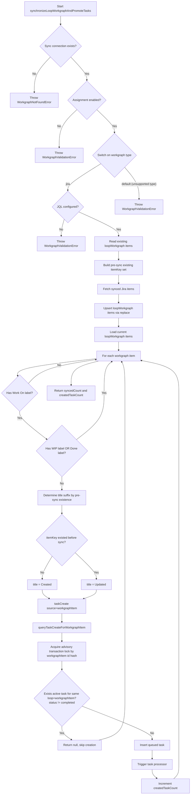

# Workgraph Sync Task Promotion Decision Tree

This diagram reflects the current implementation after the latest fixes in:

- `src/components/workgraph/workgraph.sync.service.ts`
- `src/components/task/task.controller.ts`
- `src/components/task/task.service.ts`

