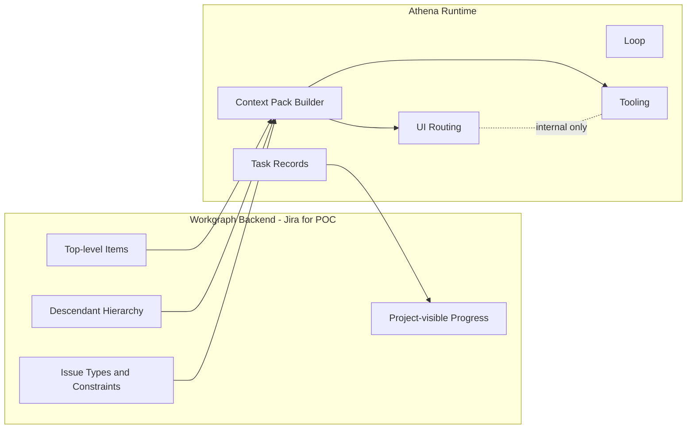
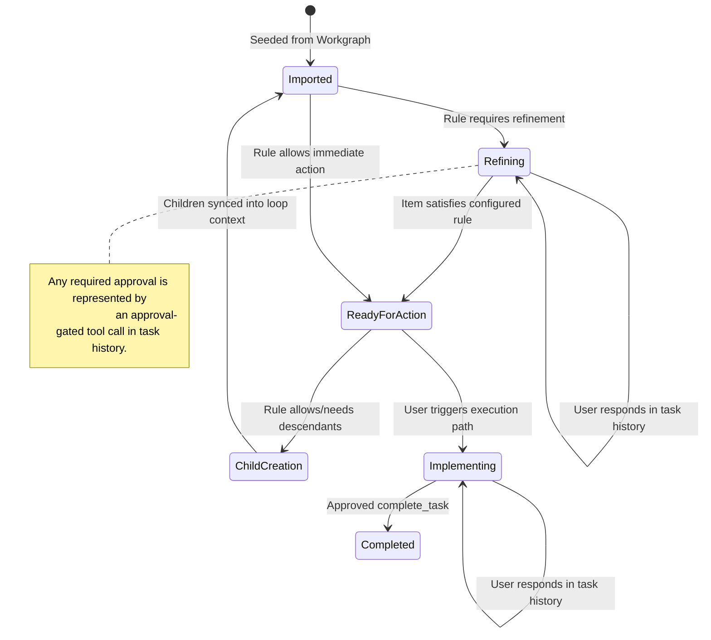

# Athena Workgraph

This document defines the Workgraph concept for Athena.

Workgraph is the external project-management work hierarchy that Athena reads from and writes to. For POC, Jira is the first Workgraph backend.

## Purpose

Workgraph is the source of truth for project work structure:

1. Top-level items and their descendants.
2. Project hierarchy semantics (item types and parent-child relationships).
3. Refined item content and implementation units according to configured rules.
4. Team-visible progress in the project-management system.

Workgraph is not responsible for Athena routing decisions. Routing/execution internals stay inside Athena runtime.

Related runtime references:

- [task.schema.ts](../src/components/task/task.schema.ts)
- [Workgraph Sync Task Promotion Decision Tree](./workgraph-sync-task-promotion-decision-tree.md)

## Boundaries

## Loop-level Workgraph Configuration

Each loop should define:

1. Workgraph connection.
2. JQL query.
3. Type-based instructions and implementation rules.

### 1) Connection

POC connection fields (Jira):

1. Base URL.
2. API credential reference.
3. Project key.

### 2) JQL query

User enters a Jira Query Language (JQL) expression directly.

Behavior:

1. Athena executes the configured JQL query.
2. The resulting issue set becomes initial loop context input.
3. Status, label, and item type inclusion/exclusion are controlled in JQL.

### 3) Type-aware rules

Athena discovers available issue types and hierarchy capabilities from Jira APIs, then lets users define behavior by issue type.

Rule shape per item type:

1. `instructions` for the personas processing the item type.
2. `allowedChildTypes`.
3. `implementable`.
4. `atomicityRequired`.
5. Optional task-source and step-sequence mapping metadata.

Example configuration (illustrative only; not an Athena-wide hierarchy):

1. A `project-goal` type may allow `milestone` children and require refinement.
2. A `milestone` type may allow `deliverable` children and require refinement.
3. A `deliverable` type may be implementable or may allow an `implementation`
   child, depending on the connected WorkGraph policy.
4. An `implementation` type may be atomic and implementable.

Athena must allow implementation at any level marked `implementable` by the
connected WorkGraph configuration. Athena must not infer semantics from an
item type's name.

## Node Progression Model

## Context Pack Strategy (No Full RAG in POC)

For POC, Athena should build a deterministic context pack from Workgraph subtree data:

1. Selected node details.
2. Ancestors.
3. Descendants (bounded by depth/size).
4. Nearby siblings when useful.
5. Linked artifacts (optional if available).

This context pack feeds LLM calls while keeping routing decisions internal to Athena.

## POC Scope

Must-have:

1. Jira connection on loop.
2. JQL query entry on loop.
3. Query-based ingestion from Jira search.
4. Jira type discovery.
5. Rule editor by type.
6. Refine and create descendants through configured tool calls.
7. Implement at user-enabled levels.

Out of scope for first POC:

1. Provider-specific prompt caching controls.
2. Full vector RAG indexing pipeline.
3. Multi-backend Workgraph writes in one loop.

## Relationship to Existing Athena Concepts

Workgraph complements existing loop and task UI behavior rather than replacing it:

1. Task schema remains runtime-owned in Athena: [task.schema.ts](../src/components/task/task.schema.ts).
2. UI task visibility remains in task views:
	 - [TaskList.tsx](../src/components/task/TaskList.tsx)
	 - [TaskDetails.tsx](../src/components/task/TaskDetails.tsx)

## Open Questions

1. Should Workgraph rules be global defaults with per-loop overrides?
2. What minimum context and instruction fields must be supplied to personas for
   each configured item type?
3. Should descendant creation happen in batch or one child level per tool call?
4. What retry/error policy should Athena use for Workgraph API failures?
5. How should a configured item type map to a task source and step sequence?
